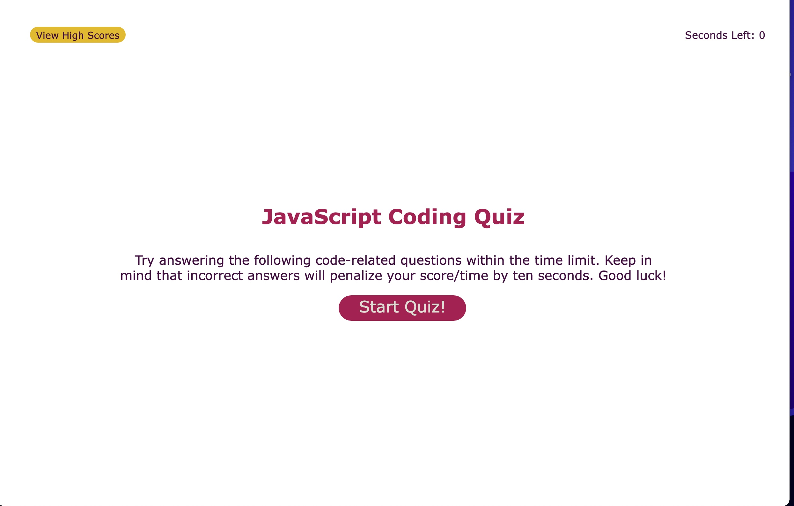
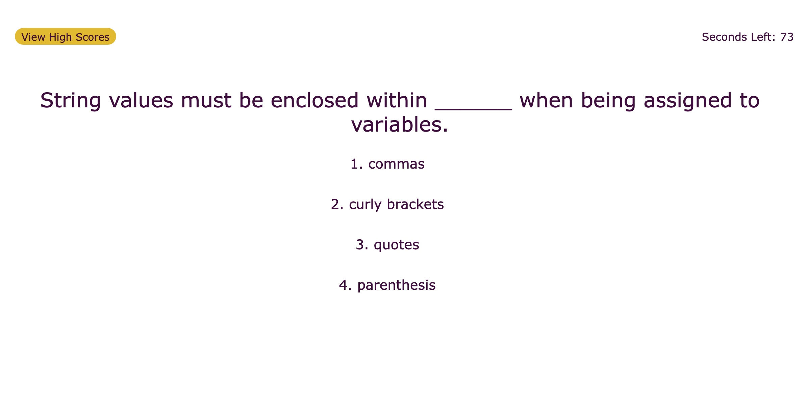
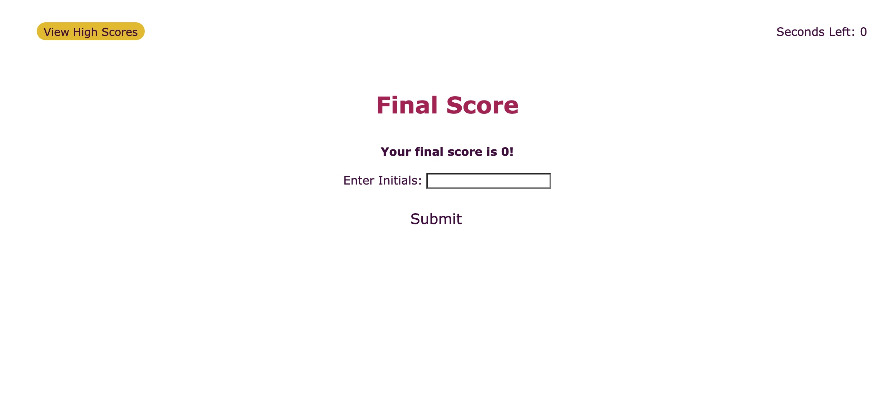
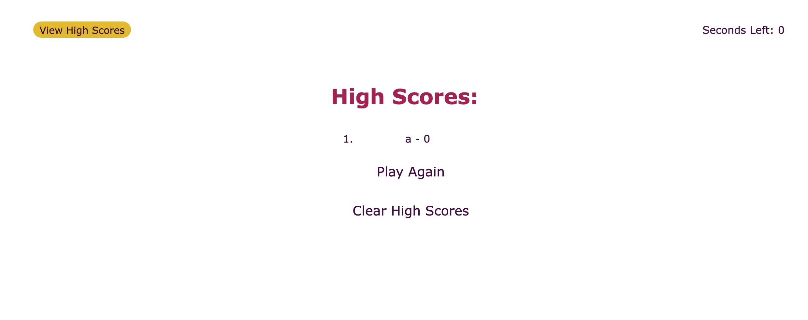

# JavaScript Coding Quiz

# How It Works

This coding quiz features a start page, question page, final score page, and high score page. By clicking the start button you are able to move through a set of JavaScript coding questions that test your knowledge. 

This quiz is timed! You are given 75 seconds to answer all 5 questions. If you get an answer 10 seconds are deducted from the time left and 5 points are subtracted from your score. 
If you answer the question correctly, 5 points are added to your score.

Once the quiz is over (you've either finished the quiz or run out of time), your final score will be displayed on the screen. From here you are able to enter your initials and save your game as a high score.

This will take you to the high score page where you can find other saved scores.

## Website 
https://ashleyhodge.github.io/js-coding-quiz/